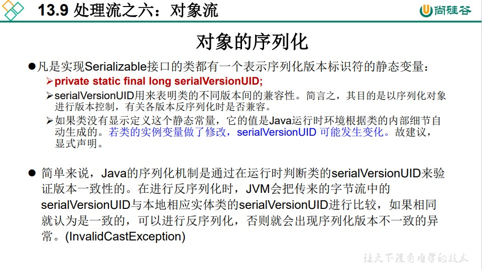

```
/**
 * 對象流的使用
 * 1.ObjectInputStream 和 ObjectOutputStream
 * 2.作用：用於存儲和讀取基本數據類型數據或對象的處理流。它的強大之處就是可以把Java中的對象寫入到數據源中，也能把對象從數據源中還原回來。
 *
 * 3.要想一個java對象是可序列化的，需要滿足相應的要求。見Person.java
 *
 * 4.序列化機制：
 * 對象序列化機制允許把內存中的Java對象轉換成平台無關的二進制流，從而允許把這種
 * 二進制流持久地保存在磁盤上，或通過網絡將這種二進制流傳輸到另一個網絡節點。
 * 當其它程序獲取了這種二進制流，就可以恢覆成原來的Java對象。

 *
 * @author shkstart
 * @create 2019 上午 10:27
 */
public class ObjectInputOutputStreamTest {

    /*
    序列化過程：將內存中的java對象保存到磁盤中或通過網絡傳輸出去
    使用ObjectOutputStream實現
     */
    @Test
    public void testObjectOutputStream(){
        ObjectOutputStream oos = null;

        try {
            //1.
            oos = new ObjectOutputStream(new FileOutputStream("object.dat"));
            //2.
            oos.writeObject(new String("我愛北京天安門"));
            oos.flush();//刷新操作

            oos.writeObject(new Person("王銘",23));
            oos.flush();

            oos.writeObject(new Person("張學良",23,1001,new Account(5000)));
            oos.flush();

        } catch (IOException e) {
            e.printStackTrace();
        } finally {
            if(oos != null){
                //3.
                try {
                    oos.close();
                } catch (IOException e) {
                    e.printStackTrace();
                }

            }
        }

    }

    /*
    反序列化：將磁盤文件中的對象還原為內存中的一個java對象
    使用ObjectInputStream來實現
     */
    @Test
    public void testObjectInputStream(){
        ObjectInputStream ois = null;
        try {
            ois = new ObjectInputStream(new FileInputStream("object.dat"));

            Object obj = ois.readObject();
            String str = (String) obj;

            Person p = (Person) ois.readObject();
            Person p1 = (Person) ois.readObject();

            System.out.println(str);
            System.out.println(p);
            System.out.println(p1);

        } catch (IOException e) {
            e.printStackTrace();
        } catch (ClassNotFoundException e) {
            e.printStackTrace();
        } finally {
            if(ois != null){
                try {
                    ois.close();
                } catch (IOException e) {
                    e.printStackTrace();
                }

            }
        }

    }
}
```

```
/**
 * Person需要滿足如下的要求，方可序列化
 * 1.需要實現接口：Serializable
 * 2.當前類提供一個全局常量：serialVersionUID
 * 3.除了當前Person類需要實現Serializable接口之外，還必須保證其內部所有屬性
 *   也必須是可序列化的。（默認情況下，基本數據類型可序列化）
 *
 *
 * 補充：ObjectOutputStream和ObjectInputStream不能序列化static和transient修飾的成員變量(要賦予的值不會被保存下來，呈現默認值)
 *
 *
 * @author shkstart
 * @create 2019 上午 10:38
 */
public class Person implements Serializable{

    public static final long serialVersionUID = 475463534532L;

    private String name;
    private int age;
    private int id;
    private Account acct;

    //private static String name;
    //private transient int age;

    public Person(String name, int age, int id) {
        this.name = name;
        this.age = age;
        this.id = id;
    }

    public Person(String name, int age, int id, Account acct) {
        this.name = name;
        this.age = age;
        this.id = id;
        this.acct = acct;
    }

    @Override
    public String toString() {
        return "Person{" +
                "name='" + name + '\'' +
                ", age=" + age +
                ", id=" + id +
                ", acct=" + acct +
                '}';
    }

    public int getId() {
        return id;
    }

    public void setId(int id) {
        this.id = id;
    }

    public String getName() {
        return name;
    }

    public void setName(String name) {
        this.name = name;
    }

    public int getAge() {
        return age;
    }

    public void setAge(int age) {
        this.age = age;
    }

    public Person(String name, int age) {

        this.name = name;
        this.age = age;
    }

    public Person() {

    }
}

class Account implements Serializable{
    public static final long serialVersionUID = 4754534532L;
    private double balance;

    @Override
    public String toString() {
        return "Account{" +
                "balance=" + balance +
                '}';
    }

    public double getBalance() {
        return balance;
    }

    public void setBalance(double balance) {
        this.balance = balance;
    }

    public Account(double balance) {

        this.balance = balance;
    }
}
```


