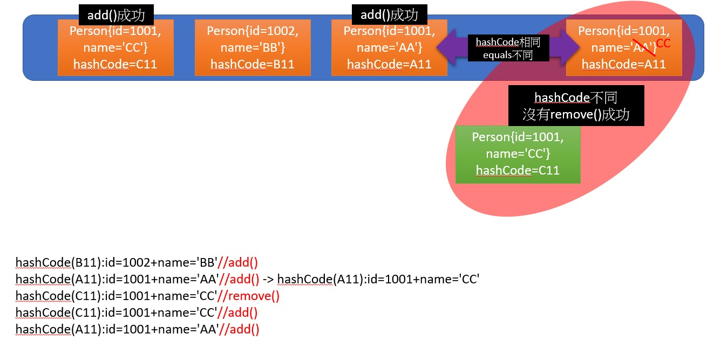

```
/**
 * @author shkstart
 * @create 2019 上午 9:36
 */
public class CollectionTest {
    @Test
    public void test1(){
        Collection coll = new ArrayList();

        coll.add(123);
        coll.add(456);
        coll.add(343);
        coll.add(343);

        coll.forEach(System.out::println);
    }


    //練習：在List內去除重覆數字值，要求盡量簡單
    public static List duplicateList(List list) {
        HashSet set = new HashSet();
        set.addAll(list);
        return new ArrayList(set);
    }
    @Test
    public void test2(){
        List list = new ArrayList();
        list.add(new Integer(1));
        list.add(new Integer(2));
        list.add(new Integer(2));
        list.add(new Integer(4));
        list.add(new Integer(4));
        List list2 = duplicateList(list);
        for (Object integer : list2) {
            System.out.println(integer);
        }
    }

    @Test
    public void test3(){
        //其中Person類中重寫了hashCode()和equal()方法
         HashSet set = new HashSet();
        Person p1 = new Person(1001,"AA");
        Person p2 = new Person(1002,"BB");

        set.add(p1);
        set.add(p2);
        System.out.println(set);//[Person{id=1002, name='BB'}, Person{id=1001, name='AA'}]

        p1.name = "CC";
        set.remove(p1);
        System.out.println(set);//[Person{id=1002, name='BB'}, Person{id=1001, name='CC'}]
        set.add(new Person(1001,"CC"));
        System.out.println(set);//[Person{id=1002, name='BB'}, Person{id=1001, name='CC'}, Person{id=1001, name='CC'}]
        set.add(new Person(1001,"AA"));
        System.out.println(set);//[Person{id=1002, name='BB'}, Person{id=1001, name='CC'}, Person{id=1001, name='CC'}, Person{id=1001, name='AA'}] 
    }
}
```

