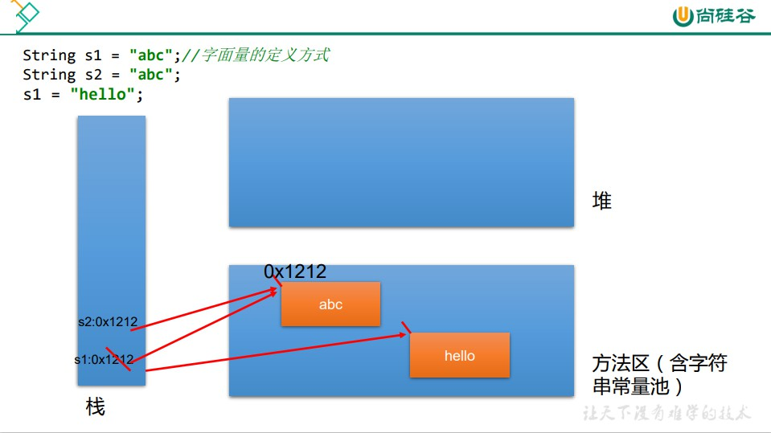
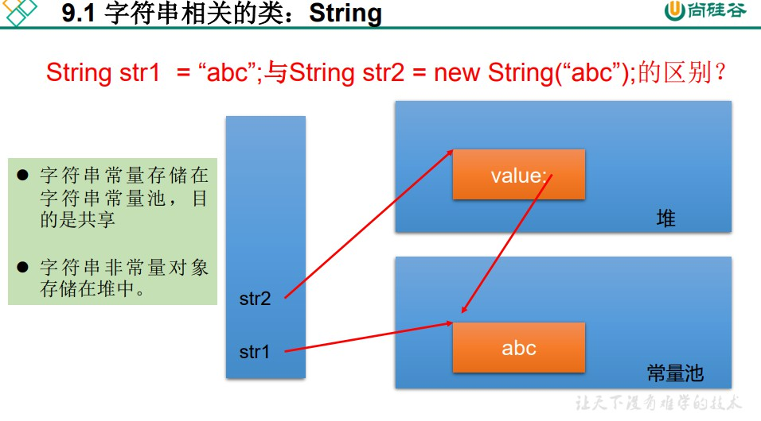
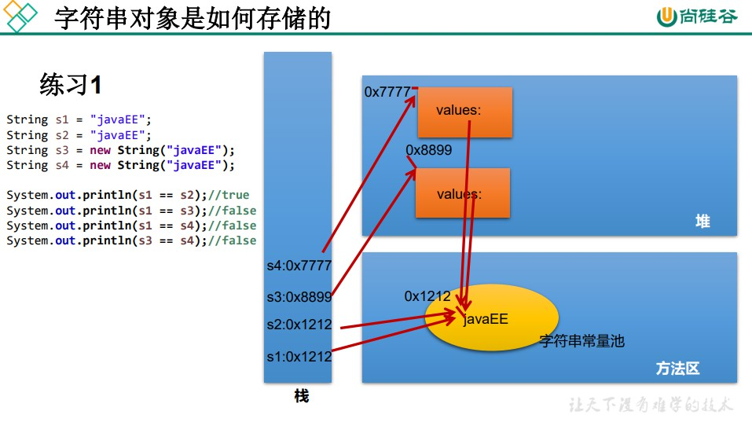
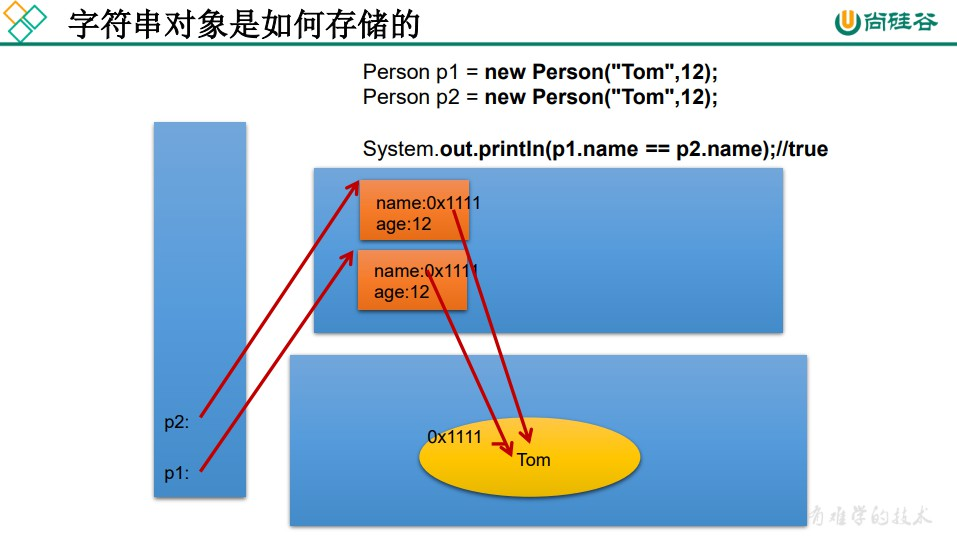

```
/**
 * String的使用
 *
 * @author shkstart
 * @create 2019 上午 10:26
 */
public class StringTest {


    /*
    結論：
    1.常量與常量的拼接結果在常量池。且常量池中不會存在相同內容的常量。
    2.只要其中有一個是變量，結果就在堆中。
    3.如果拼接的結果調用intern()方法，返回值就在常量池中
     */
    @Test
    public void test4(){
        String s1 = "javaEEhadoop";
        String s2 = "javaEE";
        String s3 = s2 + "hadoop";
        System.out.println(s1 == s3);//false

        final String s4 = "javaEE";//s4:常量
        String s5 = s4 + "hadoop";
        System.out.println(s1 == s5);//true

    }

    @Test
    public void test3(){
        String s1 = "javaEE";
        String s2 = "hadoop";

        String s3 = "javaEEhadoop";
        String s4 = "javaEE" + "hadoop";
        String s5 = s1 + "hadoop";
        String s6 = "javaEE" + s2;
        String s7 = s1 + s2;

        System.out.println(s3 == s4);//true
        System.out.println(s3 == s5);//false
        System.out.println(s3 == s6);//false
        System.out.println(s3 == s7);//false
        System.out.println(s5 == s6);//false
        System.out.println(s5 == s7);//false
        System.out.println(s6 == s7);//false

        String s8 = s6.intern();//返回值得到的s8使用的常量值中已經存在的“javaEEhadoop”
        System.out.println(s3 == s8);//true


    }

    /*
    String的實例化方式：
    方式一：通過字面量定義的方式
    方式二：通過new + 構造器的方式

     面試題：String s = new String("abc");方式創建對象，在內存中創建了幾個對象？
            兩個:一個是堆空間中new結構，另一個是char[]對應的常量池中的數據："abc"

     */
    @Test
    public void test2(){
        //通過字面量定義的方式：此時的s1和s2的數據javaEE聲明在方法區中的字符串常量池中。
        String s1 = "javaEE";
        String s2 = "javaEE";
        //通過new + 構造器的方式:此時的s3和s4保存的地址值，是數據在堆空間中開辟空間以後對應的地址值。
        String s3 = new String("javaEE");
        String s4 = new String("javaEE");

        System.out.println(s1 == s2);//true
        System.out.println(s1 == s3);//false
        System.out.println(s1 == s4);//false
        System.out.println(s3 == s4);//false

        System.out.println("***********************");
        Person p1 = new Person("Tom",12);
        Person p2 = new Person("Tom",12);

        System.out.println(p1.name.equals(p2.name));//true
        System.out.println(p1.name == p2.name);//true

        p1.name = "Jerry";
        System.out.println(p2.name);//Tom
    }


    /*
    String:字符串，使用一對""引起來表示。
    1.String聲明為final的，不可被繼承
    2.String實現了Serializable接口：表示字符串是支持序列化的。
            實現了Comparable接口：表示String可以比較大小
    3.String內部定義了final char[] value用於存儲字符串數據
    4.String:代表不可變的字符序列。簡稱：不可變性。
        體現：1.當對字符串重新賦值時，需要重寫指定內存區域賦值，不能使用原有的value進行賦值。
             2. 當對現有的字符串進行連接操作時，也需要重新指定內存區域賦值，不能使用原有的value進行賦值。
             3. 當調用String的replace()方法修改指定字符或字符串時，也需要重新指定內存區域賦值，不能使用原有的value進行賦值。
    5.通過字面量的方式（區別於new）給一個字符串賦值，此時的字符串值聲明在字符串常量池中。
    6.字符串常量池中是不會存儲相同內容的字符串的。
     */
    @Test
    public void test1(){
        String s1 = "abc";//字面量的定義方式
        String s2 = "abc";
        s1 = "hello";

        System.out.println(s1 == s2);//比較s1和s2的地址值

        System.out.println(s1);//hello
        System.out.println(s2);//abc

        System.out.println("*****************");

        String s3 = "abc";
        s3 += "def";
        System.out.println(s3);//abcdef
        System.out.println(s2);

        System.out.println("*****************");

        String s4 = "abc";
        String s5 = s4.replace('a', 'm');
        System.out.println(s4);//abc
        System.out.println(s5);//mbc

    }

}
```





```
/**
 * 一道面試題
 * @author shkstart
 * @create 2019 上午 11:32
 */
public class StringTest {

    String str = new String("good");
    char[] ch = { 't', 'e', 's', 't' };

    public void change(String str, char ch[]) {
        str = "test ok";
        ch[0] = 'b';
    }
    public static void main(String[] args) {
        StringTest ex = new StringTest();
        ex.change(ex.str, ex.ch);
        System.out.println(ex.str);//good
        System.out.println(ex.ch);//best
    }
}
```