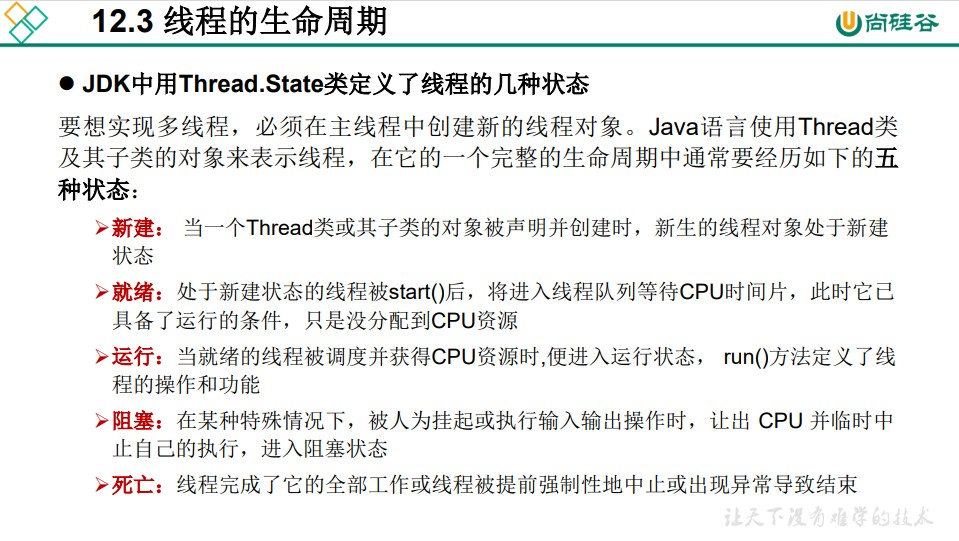
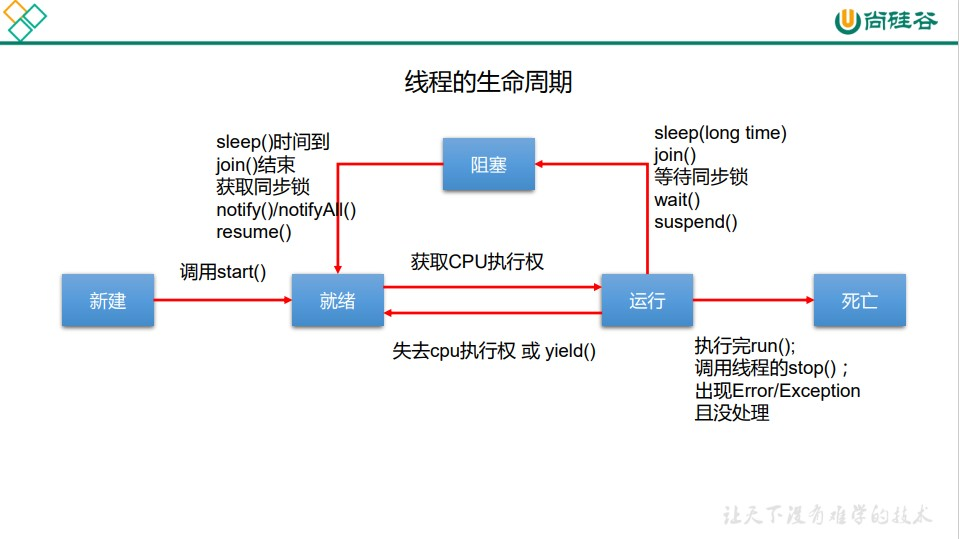
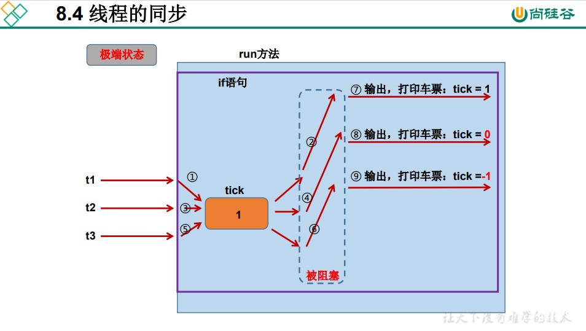
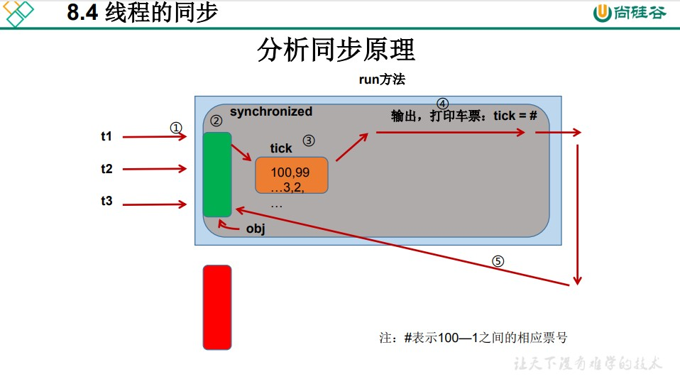

```
/**
 * 多線程的創建，方式一：繼承於Thread類
 * 1. 創建一個繼承於Thread類的子類
 * 2. 重寫Thread類的run() --> 將此線程執行的操作聲明在run()中
 * 3. 創建Thread類的子類的對象
 * 4. 通過此對象調用start()
 * <p>
 * 例子：遍歷100以內的所有的偶數
 *
 * @author shkstart
 * @create 2019-02-13 上午 11:46
 */

//1. 創建一個繼承於Thread類的子類
class MyThread extends Thread {
    //2. 重寫Thread類的run()
    @Override
    public void run() {
        for (int i = 0; i < 100; i++) {
            if(i % 2 == 0){
                System.out.println(Thread.currentThread().getName() + ":" + i);
            }
        }
    }
}


public class ThreadTest {
    public static void main(String[] args) {
        //3. 創建Thread類的子類的對象
        MyThread t1 = new MyThread();

        //4.通過此對象調用start():①啟動當前線程 ② 調用當前線程的run()
        t1.start();
        //問題一：我們不能通過直接調用run()的方式啟動線程。
//        t1.run();

        //問題二：再啟動一個線程，遍歷100以內的偶數。不可以還讓已經start()的線程去執行。會報IllegalThreadStateException
//        t1.start();
        //我們需要重新創建一個線程的對象
        MyThread t2 = new MyThread();
        t2.start();


        //如下操作仍然是在main線程中執行的。
        for (int i = 0; i < 100; i++) {
            if(i % 2 == 0){
                System.out.println(Thread.currentThread().getName() + ":" + i + "***********main()************");
            }
        }
    }

}
```

```
/**
 * 練習：創建兩個分線程，其中一個線程遍歷100以內的偶數，另一個線程遍歷100以內的奇數
 *
 *
 * @author shkstart
 * @create 2019-02-13 下午 2:16
 */
public class ThreadDemo {
    public static void main(String[] args) {
//        MyThread1 m1 = new MyThread1();
//        MyThread2 m2 = new MyThread2();
//
//        m1.start();
//        m2.start();

        //創建Thread類的匿名子類的方式
        new Thread(){
            @Override
            public void run() {
                for (int i = 0; i < 100; i++) {
                    if(i % 2 == 0){
                        System.out.println(Thread.currentThread().getName() + ":" + i);

                    }
                }
            }
        }.start();

        new Thread(){
            @Override
            public void run() {
                for (int i = 0; i < 100; i++) {
                    if(i % 2 != 0){
                        System.out.println(Thread.currentThread().getName() + ":" + i);

                    }
                }
            }
        }.start();

    }
}

class MyThread1 extends Thread{
    @Override
    public void run() {
        for (int i = 0; i < 100; i++) {
            if(i % 2 == 0){
                System.out.println(Thread.currentThread().getName() + ":" + i);

            }
        }

    }
}

class MyThread2 extends Thread{
    @Override
    public void run() {
        for (int i = 0; i < 100; i++) {
            if(i % 2 != 0){
                System.out.println(Thread.currentThread().getName() + ":" + i);

            }
        }

    }
}
```

```
/**
 * 測試Thread中的常用方法：
 * 1. start():啟動當前線程；調用當前線程的run()
 * 2. run(): 通常需要重寫Thread類中的此方法，將創建的線程要執行的操作聲明在此方法中
 * 3. currentThread():靜態方法，返回執行當前代碼的線程
 * 4. getName():獲取當前線程的名字
 * 5. setName():設置當前線程的名字
 * 6. yield():釋放當前cpu的執行權
 *            6.1 暫停當前正在執行的線程,把執行機會讓給優先及相同或更高的線程(有可能被暫停的線程又重新分配到執行權)
 *            6.2 若對列中沒有同優先級的線程,忽略此方法
 * 7. join():在線程a中調用線程b的join(),此時線程a就進入阻塞狀態，直到線程b完全執行完以後，線程a才
 *           結束阻塞狀態。
 * 8. stop():已過時。當執行此方法時，強制結束當前線程。
 * 9. sleep(long millitime):讓當前線程“睡眠”指定的millitime毫秒。在指定的millitime毫秒時間內，當前
 *                          線程是阻塞狀態。
 * 10. isAlive():判斷當前線程是否存活
 *
 *
 * 線程的優先級：
 * 1.
 * MAX_PRIORITY：10
 * MIN _PRIORITY：1
 * NORM_PRIORITY：5  -->默認優先級
 * 2.如何獲取和設置當前線程的優先級：
 *   getPriority():獲取線程的優先級
 *   setPriority(int p):設置線程的優先級
 *
 *   說明：高優先級的線程要搶占低優先級線程cpu的執行權。但是只是從概率上講，高優先級的線程高概率的情況下
 *   被執行。並不意味著只有當高優先級的線程執行完以後，低優先級的線程才執行。
 *
 *
 * @author shkstart
 * @create 2019-02-13 下午 2:26
 */
class HelloThread extends Thread{
    @Override
    public void run() {
        //this相當於Thread.currentThread()

        for (int i = 0; i < 100; i++) {
            if(i % 2 == 0){

//                try {
//                    sleep(10);
//                } catch (InterruptedException e) {
//                    e.printStackTrace();
//                }

                System.out.println(Thread.currentThread().getName() + ":" + Thread.currentThread().getPriority() + ":" + i);
            }

//            if(i % 20 == 0){
//                yield();
//            }

        }

    }

    public HelloThread(String name){
        super(name);
    }
}


public class ThreadMethodTest {
    public static void main(String[] args) {

        HelloThread h1 = new HelloThread("Thread：1");

//        h1.setName("線程一");
        //設置分線程的優先級
        h1.setPriority(Thread.MAX_PRIORITY);

        h1.start();

        //給主線程命名
        Thread.currentThread().setName("主線程");
        Thread.currentThread().setPriority(Thread.MIN_PRIORITY);

        for (int i = 0; i < 100; i++) {
            if(i % 2 == 0){
                System.out.println(Thread.currentThread().getName() + ":" + Thread.currentThread().getPriority() + ":" + i);
            }

//            if(i == 20){
//                try {
//                    h1.join();
//                } catch (InterruptedException e) {
//                    e.printStackTrace();
//                }
//            }

        }

//        System.out.println(h1.isAlive());

    }
}
```

```
/**
 *
 * 例子：創建三個窗口賣票，總票數為100張.使用繼承Thread類的方式
 *
 * 存在線程的安全問題，待解決。
 *
 * @author shkstart
 * @create 2019-02-13 下午 4:20
 */
class Window extends Thread{
    private static int ticket = 100;

    @Override
    public void run() {
        while(true){
            if(ticket > 0){
                System.out.println(getName() + "：賣票，票號為：" + ticket);
                ticket--;
            }else{
                break;
            }
        }
    }
}

public class WindowTest {
    public static void main(String[] args) {
        Window t1 = new Window();
        Window t2 = new Window();
        Window t3 = new Window();

        t1.setName("窗口1");
        t2.setName("窗口2");
        t3.setName("窗口3");

        t1.start();
        t2.start();
        t3.start();
    }
}
```

```
/**
 * 創建多線程的方式二：實現Runnable接口
 * 1. 創建一個實現了Runnable接口的類
 * 2. 實現類去實現Runnable中的抽象方法：run()
 * 3. 創建實現類的對象
 * 4. 將此對象作為參數傳遞到Thread類的構造器中，創建Thread類的對象
 * 5. 通過Thread類的對象調用start()
 *
 *
 * 比較創建線程的兩種方式。
 * 開發中：優先選擇：實現Runnable接口的方式
 * 原因：1. 實現的方式沒有類的單繼承性的局限性
 *      2. 實現的方式更適合來處理多個線程有共享數據的情況。
 *
 * 聯系：public class Thread implements Runnable
 * 相同點：兩種方式都需要重寫run(),將線程要執行的邏輯聲明在run()中。
 *
 * @author shkstart
 * @create 2019-02-13 下午 4:34
 */
//1. 創建一個實現了Runnable接口的類
class MThread implements Runnable{

    //2. 實現類去實現Runnable中的抽象方法：run()
    @Override
    public void run() {
        for (int i = 0; i < 100; i++) {
            if(i % 2 == 0){
                System.out.println(Thread.currentThread().getName() + ":" + i);
            }

        }
    }
}

public class ThreadTest1 {
    public static void main(String[] args) {
        //3. 創建實現類的對象
        MThread mThread = new MThread();
        //4. 將此對象作為參數傳遞到Thread類的構造器中，創建Thread類的對象
        Thread t1 = new Thread(mThread);
        t1.setName("線程1");
        //5. 通過Thread類的對象調用start():① 啟動線程 ②調用當前線程的run()-->調用了Runnable類型的target的run()
        t1.start();

        //再啟動一個線程，遍歷100以內的偶數
        Thread t2 = new Thread(mThread);
        t2.setName("線程2");
        t2.start();
    }

}
```

```
/**
 * 例子：創建三個窗口賣票，總票數為100張.使用實現Runnable接口的方式
 * 存在線程的安全問題，待解決。
 *
 * @author shkstart
 * @create 2019-02-13 下午 4:47
 */
class Window1 implements Runnable{
    private int ticket = 100;

    @Override
    public void run() {
        while(true){
            if(ticket > 0){
                System.out.println(Thread.currentThread().getName() + ":賣票，票號為：" + ticket);
                ticket--;
            }else{
                break;
            }
        }
    }
}

public class WindowTest1 {
    public static void main(String[] args) {
        Window1 w = new Window1();

        Thread t1 = new Thread(w);
        Thread t2 = new Thread(w);
        Thread t3 = new Thread(w);

        t1.setName("窗口1");
        t2.setName("窗口2");
        t3.setName("窗口3");

        t1.start();
        t2.start();
        t3.start();
    }
}
```

# 程序(programm)
概念：是為完成特定任務、用某種語言編寫的一組指令的集合。即指一段靜態的代碼。

# 進程(process)
概念：程序的一次執行過程，或是正在運行的一個程序。
說明：進程作為資源分配的單位，系統在運行時會為每個進程分配不同的內存區域

# 線程(thread)
概念：進程可進一步細化為線程，是一個程序內部的一條執行路徑。
說明：線程作為調度和執行的單位，每個線程擁獨立的運行棧和程序計數器(pc)，線程切換的開銷小。
 * 進程可以細化為多個線程。
 * 每個線程，擁有自己獨立的：棧、程序計數器
 * 多個線程，共享同一個進程中的結構：方法區、堆。

# 何時需要多線程
 1. 程序需要同時執行兩個或多個任務。
 2. 程序需要實現一些需要等待的任務時，如用戶輸入、文件讀寫操作、網絡操作、搜索等。
 3. 需要一些後台運行的程序時。


# 單核CPU與多核CPU的理解
 * 單核CPU，其實是一種假的多線程，因為在一個時間單元內，也只能執行一個線程的任務。例如：雖然有多車道，但是收費站只有一個工作人員在收費，只有收了費才能通過，那麽CPU就好比收費人員。如果某個人不想交錢，那麽收費人員可以把他“掛起”（晾著他，等他想通了，準備好了錢，再去收費。）但是因為CPU時間單元特別短，因此感覺不出來。
 * 如果是多核的話，才能更好的發揮多線程的效率。（現在的服務器都是多核的）
 * 一個Java應用程序java.exe，其實至少三個線程：main()主線程，gc()垃圾回收線程，異常處理線程。當然如果發生異常，會影響主線程。

# 並行與並發的理解
並行：多個CPU同時執行多個任務。比如：多個人同時做不同的事。  
並發：一個CPU(采用時間片)同時執行多個任務。比如：秒殺、多個人做同一件事  
舉例：一個體育館中有多個籃球場，籃球場相當於多個CPU，籃球場中多個人同時在打自己的比賽。一個籃球場中有多個人同時在搶球

# 創建多線程的兩種方式
> * 方式一：繼承Thread類的方式：
>   1. 創建一個繼承於Thread類的子類
>   2. 重寫Thread類的run() --> 將此線程執行的操作聲明在run()中
>   3. 創建Thread類的子類的對象
>   4. 通過此對象調用start()：①啟動當前線程 ② 調用當前線程的run()
>> * 說明兩個問題：  
>>   問題一：我們啟動一個線程，必須調用start()，不能調用run()的方式啟動線程。  
>>   問題二：如果再啟動一個線程，必須重新創建一個Thread子類的對象，調用此對象的start()
>
> * 方式二：實現Runnable接口的方式：
>   1. 創建一個實現了Runnable接口的類
>   2. 實現類去實現Runnable中的抽象方法：run()
>   3. 創建實現類的對象
>   4. 將此對象作為參數傳遞到Thread類的構造器中，創建Thread類的對象
>   5. 通過Thread類的對象調用start()
>
> * 兩種方式的對比：
>>  1. 開發中：優先選擇：實現Runnable接口的方式
>>  2. 原因：  
>>     1. 實現的方式沒類的單繼承性的局限性
>>     2. 實現的方式更適合來處理多個線程共享數據的情況。
>>   3. 聯系：public class Thread implements Runnable
>>     4. 相同點：兩種方式都需要重寫run(),將線程要執行的邏輯聲明在run()中。目前兩種方式，要想啟動線程，都是調用的Thread類中的start()。

# Thread類中的常用的方法:
1. start():啟動當前線程；調用當前線程的run()
2. run(): 通常需要重寫Thread類中的此方法，將創建的線程要執行的操作聲明在此方法中
3. currentThread():靜態方法，返回執行當前代碼的線程
4. getName():獲取當前線程的名字
5. setName():設置當前線程的名字
6. yield():釋放當前cpu的執行權
7. join():在線程a中調用線程b的join(),此時線程a就進入阻塞狀態，直到線程b完全執行完以後，線程a才結束阻塞狀態。
8. stop():已過時。當執行此方法時，強制結束當前線程。
9. sleep(long millitime):讓當前線程“睡眠”指定的millitime毫秒。在指定的millitime毫秒時間內，當前線程是阻塞狀態。
10. isAlive():判斷當前線程是否存活

# 線程的優先級：
1. MAX_PRIORITY：10
 MIN _PRIORITY：1
 NORM_PRIORITY：5  -->默認優先級
2. 如何獲取和設置當前線程的優先級：
   getPriority():獲取線程的優先級
   setPriority(int p):設置線程的優先級
* 說明：高優先級的線程要搶占低優先級線程cpu的執行權。但是只是從概率上講，高優先級的線程高概率的情況下被執行。並不意味著只當高優先級的線程執行完以後，低優先級的線程才執行。

* 線程通信：wait() / notify() / notifyAll() :此三個方法定義在Object類中的。

* 補充：線程的分類
  * 一種是守護線程(gc()垃圾回收線程)，一種是用戶線程(main()主線程)。用戶線程結束時守護線程也會結束。

# 線程的生命週期




