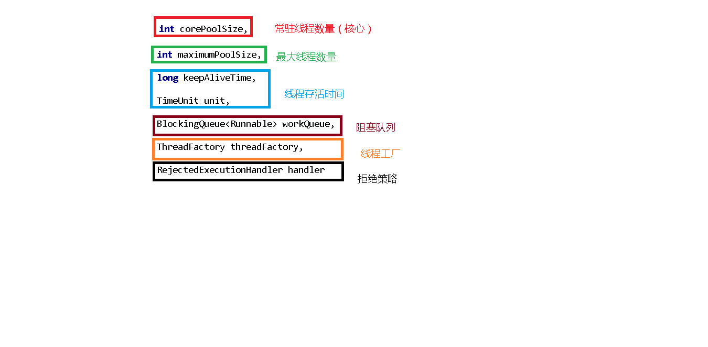
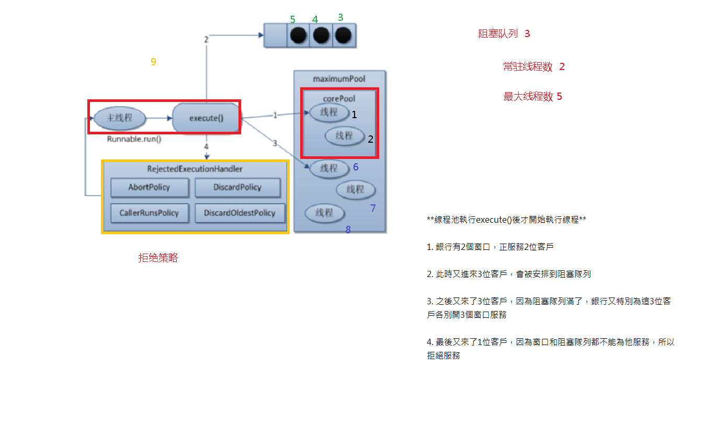
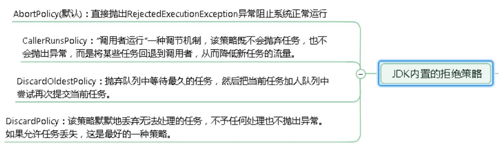

# 線程池
```
//演示線程池三種常用分類
public class ThreadPoolDemo1 {
    public static void main(String[] args) {
        //一池五線程
        ExecutorService threadPool1 = Executors.newFixedThreadPool(5); //5個窗口

        //一池一線程
        ExecutorService threadPool2 = Executors.newSingleThreadExecutor(); //一個窗口

        //一池可擴容線程
        ExecutorService threadPool3 = Executors.newCachedThreadPool();
        //10個顧客請求
        try {
            for (int i = 1; i <=10; i++) {
                //執行
                threadPool3.execute(()->{
                    System.out.println(Thread.currentThread().getName()+" 辦理業務");
                });
            }
        }catch (Exception e) {
            e.printStackTrace();
        }finally {
            //關閉
            threadPool3.shutdown();
        }

    }
}
```




```
//自定義線程池創建
public class ThreadPoolDemo2 {
    public static void main(String[] args) {
        ExecutorService threadPool = new ThreadPoolExecutor(
                2,
                5,
                2L,
                TimeUnit.SECONDS,
                new ArrayBlockingQueue<>(3),
                Executors.defaultThreadFactory(),
                new ThreadPoolExecutor.AbortPolicy()
        );

        //10個顧客請求
        try {
            for (int i = 1; i <=10; i++) {
                //執行
                threadPool.execute(()->{
                    System.out.println(Thread.currentThread().getName()+" 辦理業務");
                });
            }
        }catch (Exception e) {
            e.printStackTrace();
        }finally {
            //關閉
            threadPool.shutdown();
        }
    }
}
```