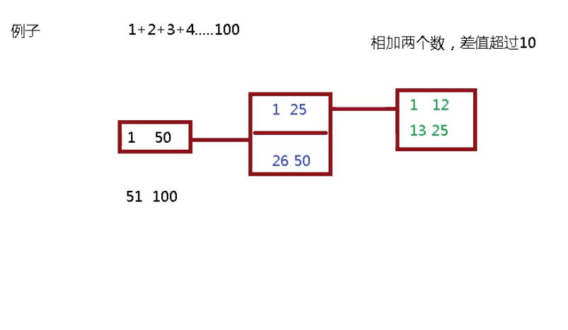

# 線程合併拆分

```
import java.util.concurrent.*;

class MyTask extends RecursiveTask<Integer> {

    //拆分差值不能超過10，計算10以內運算
    private static final Integer VALUE = 10;
    private int begin ;//拆分開始值
    private int end;//拆分結束值
    private int result ; //返回結果

    //創建有參數構造
    public MyTask(int begin,int end) {
        this.begin = begin;
        this.end = end;
    }

    //拆分和合並過程
    @Override
    protected Integer compute() {
        //判斷相加兩個數值是否大於10
        if((end-begin)<=VALUE) {
            //相加操作
            for (int i = begin; i <=end; i++) {
                result = result+i;
            }
        } else {//進一步拆分
            //獲取中間值
            int middle = (begin+end)/2;
            //拆分左邊
            MyTask task01 = new MyTask(begin,middle);
            //拆分右邊
            MyTask task02 = new MyTask(middle+1,end);
            //調用方法拆分
            task01.fork();
            task02.fork();
            //合並結果
            result = task01.join()+task02.join();
        }
        return result;
    }
}

public class ForkJoinDemo {
    public static void main(String[] args) throws ExecutionException, InterruptedException {
        //創建MyTask對象
        MyTask myTask = new MyTask(0,100);
        //創建分支合並池對象
        ForkJoinPool forkJoinPool = new ForkJoinPool();
        ForkJoinTask<Integer> forkJoinTask = forkJoinPool.submit(myTask);
        //獲取最終合並之後結果
        Integer result = forkJoinTask.get();
        System.out.println(result);
        //關閉池對象
        forkJoinPool.shutdown();
    }
}
```