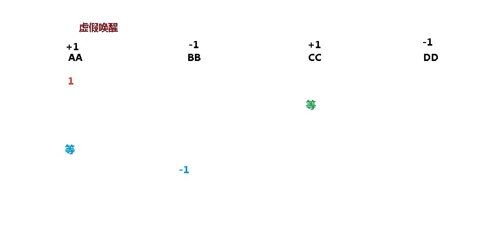

# 線程通信-虛假喚醒

```
//第一步 創建資源類，定義屬性和操作方法
class Share {
    //初始值
    private int number = 0;
    //+1的方法
    public synchronized void incr() throws InterruptedException {
        //第二步 判斷 幹活 通知
        while(number != 0) { //判斷number值是否是0，如果不是0，等待
            this.wait(); //在哪里睡，就在哪里醒
        }
        //如果number值是0，就+1操作
        number++;
        System.out.println(Thread.currentThread().getName()+" :: "+number);
        //通知其他線程
        this.notifyAll();
    }

    //-1的方法
    public synchronized void decr() throws InterruptedException {
        //判斷
        while(number != 1) {
            this.wait();
        }
        //幹活
        number--;
        System.out.println(Thread.currentThread().getName()+" :: "+number);
        //通知其他線程
        this.notifyAll();
    }
}

public class ThreadDemo1 {
    //第三步 創建多個線程，調用資源類的操作方法
    public static void main(String[] args) {
        Share share = new Share();
        //創建線程
        new Thread(()->{
            for (int i = 1; i <=10; i++) {
                try {
                    share.incr(); //+1
                } catch (InterruptedException e) {
                    e.printStackTrace();
                }
            }
        },"AA").start();

        new Thread(()->{
            for (int i = 1; i <=10; i++) {
                try {
                    share.decr(); //-1
                } catch (InterruptedException e) {
                    e.printStackTrace();
                }
            }
        },"BB").start();

        new Thread(()->{
            for (int i = 1; i <=10; i++) {
                try {
                    share.incr(); //+1
                } catch (InterruptedException e) {
                    e.printStackTrace();
                }
            }
        },"CC").start();

        new Thread(()->{
            for (int i = 1; i <=10; i++) {
                try {
                    share.decr(); //-1
                } catch (InterruptedException e) {
                    e.printStackTrace();
                }
            }
        },"DD").start();
    }
}
```