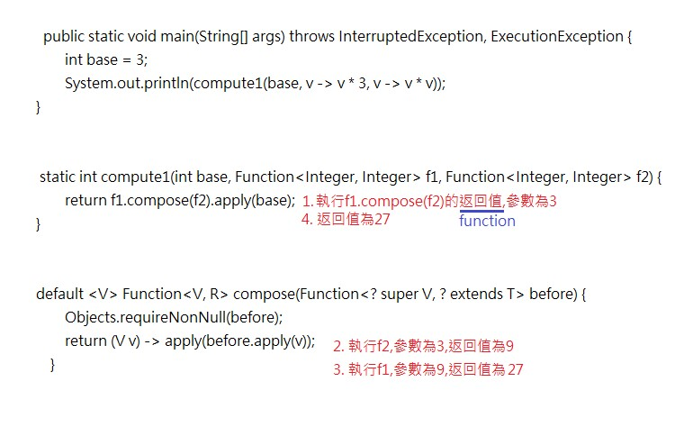
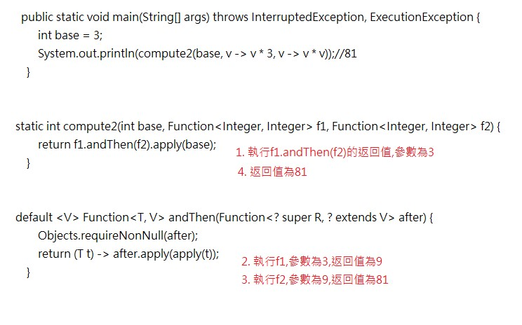

# Function 方法使用
```
 public static void main(String[] args) throws InterruptedException, ExecutionException {
        int base = 3;
        System.out.println(compute1(base, v -> v * 3, v -> v * v));//27
        System.out.println(compute2(base, v -> v * 3, v -> v * v));//81
    }

static int compute1(int base, Function<Integer, Integer> f1, Function<Integer, Integer> f2) {
    return f1.compose(f2).apply(base);
}

static int compute2(int base, Function<Integer, Integer> f1, Function<Integer, Integer> f2) {
    return f1.andThen(f2).apply(base);
}
```


***


# Predicate 方法使用
```
public static void main(String[] args) {      
        System.out.println(Predicate.isEqual(new Date()).test(new Date()));//false,執行上的時間差
        System.out.println(new Date().equals(new Date()));//true
    }
```

# BinaryOperator 方法使用
```
public static void main(String[] args) {
    System.out.println(getShort("hello", "word", (a, b) -> a.length() - b.length()));//word
    System.out.println(getShort("hello", "word", (a, b) -> a.charAt(0) - b.charAt(0)));//hello       
}

    static String getShort(String a, String b, Comparator<String> comparator) {
    return BinaryOperator.minBy(comparator).apply(a, b);
}
```