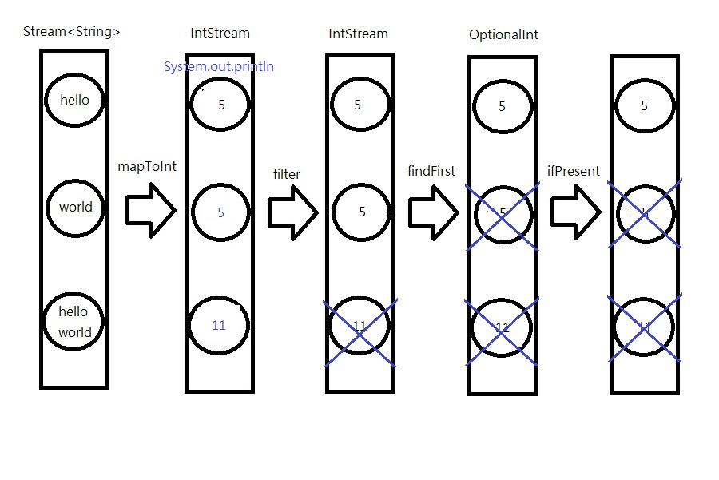
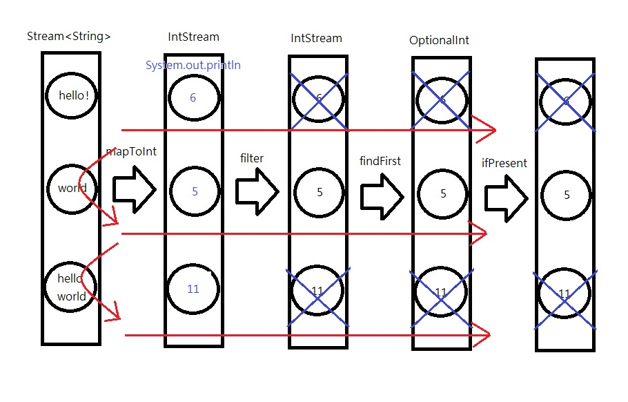

# stream
```
public static void main(String[] args) {
    IntStream.of(new int[]{3, 4, 5, 6}).forEach(System.out::println);//3 4 5 6

//        IntStream.of(3, 4, 5, 6).forEach(System.out::println);//3 4 5 6
//        Stream.of(new int[]{3, 4, 5, 6}).forEach(System.out::println);//[I@2acf57e3
//        Stream.of(3, 4, 5, 6).forEach(System.out::println);//3 4 5 6

    IntStream.range(3,7).forEach(System.out::println);//3 4 5 6
    IntStream.rangeClosed(3,7).forEach(System.out::println);//3 4 5 6 7
}
```

```
   public static void main(String[] args) {
        Stream<String> stringStream = Stream.of("hello", "world", "helloworld");

        //流轉換集合 方式一
//        List<String> l1 = stringStream.collect(Collectors.toList());
//        l1.forEach(System.out::println);

        //流轉換集合 方式二
//        List<String> l2 = stringStream.collect(ArrayList::new,
//                (list, item) -> list.add(item),
//                (list1, list2) -> list1.addAll(list2));
//        l2.forEach(System.out::println);

        //流轉換集合 方式三
        /**
         * 參數一:最終要返回的集合
         * 參數二:源集合創建的流中，將每個元素添加到參數一的集合，並產生新的流
         * 參數三:將添加過程中產生的流合併，並添加到參數一的集合
         */
        List<String> l3 = stringStream.collect(ArrayList::new,
                ArrayList::add,
                ArrayList::addAll);
        l3.forEach(System.out::println);

        /*
        在您提供的程式碼中，`l3` 可以使用方法參考是因為 `ArrayList::add` 和 `ArrayList::addAll` 都是適用於方法參考的方法參考的形式。
        在這裡，方法引用的參數和返回類型與 `collect` 方法所期望的 `BiConsumer<R, ? super T>` 參數相符。
        讓我們來解釋為什麼 `ArrayList::add` 和 `ArrayList::addAll` 可以當作方法參考使用：

        1. `ArrayList::add` 方法參考：
            - `ArrayList::add` 是一個實例方法引用，它的參數是一個元素，類型是方法引用所在類別的類型（在這種情況下是 `ArrayList`）。
            - `BiConsumer<R, ? super T>` 的第二個參數是一個元素，因此 `ArrayList::add` 的參數與 `BiConsumer` 介面的參數類型相符。

        2. `ArrayList::addAll` 方法參考：
            - `ArrayList::addAll` 是一個實例方法引用，它的參數是一個集合，類型也是方法引用所在類別的類型（在這種情況下是 `ArrayList`）。
            - `BiConsumer<R, ? super T>` 的第二個參數是一個元素，但是因為 `addAll` 接受一個集合作為參數，
            所以 `ArrayList::addAll` 的參數與 `BiConsumer` 介面的參數類型相符。

        因此，`ArrayList::add` 和 `ArrayList::addAll` 可以直接用作方法引用，而不需要明確編寫 Lambda 表達式。
        在這裡，不需要相同的返回值類型，只需要參數類型匹配。
        需要注意的是，方法引用的參數類型必須匹配函數式介面的參數類型，但不要求傳回值類型匹配。 這是 Java 中方法引用的靈活性之一。
         */
}
```

```
public static void main(String[] args) {
    //找出流中大於2的元素，然後將每個元素乘以2，然後忽略掉流中的前兩個元素，然後再取流中的前兩個元素，最後求出流中元素的總和
    Stream<Integer> stream = Stream.iterate(1, item -> item + 2).limit(6);
    IntStream intStream = stream.filter(item -> item > 2).mapToInt(item -> item * 2).skip(2).limit(2);//使用mapToInt是避免自動拆裝箱損失效能
//        int sum = intStream.sum();
//        System.out.println(sum);

    IntSummaryStatistics intSummaryStatistics = intStream.summaryStatistics();
    //求和
    System.out.println(intSummaryStatistics.getSum());//32

    //求最大值
    System.out.println(intSummaryStatistics.getMax());//18

    //求最小值
    System.out.println(intSummaryStatistics.getMin());//14

    //case:篩選後沒有元素
    Stream<Integer> stream2 = Stream.iterate(1, item -> item + 2).limit(6);
    intStream = stream2.filter(item -> item > 200).mapToInt(item -> item * 2).skip(2).limit(2);
    intSummaryStatistics = intStream.summaryStatistics();

    //求和
    System.out.println(intSummaryStatistics.getSum());//0

    //求最大值
    System.out.println(intSummaryStatistics.getMax());//-2147483648

    //求最小值
    System.out.println(intSummaryStatistics.getMin());//2147483647
}
```

# 串行流與並行流
```
public static void main(String[] args) {
    List<String> list = new ArrayList<>(5000000);
    for (int i = 0; i < 5000000; i++) {
        list.add(UUID.randomUUID().toString());
    }

    //串行流
//        System.out.println("開始排序");
//        long startTime = System.nanoTime();
//        list.stream().sorted().count();
//        long endTime = System.nanoTime();
//        System.out.println("排序耗時:" + TimeUnit.NANOSECONDS.toMicros(endTime - startTime) + "微秒");

    //並行流
    System.out.println("開始排序");
    long startTime = System.nanoTime();
    list.parallelStream().sorted().count();
    long endTime = System.nanoTime();
    System.out.println("排序耗時:" + TimeUnit.NANOSECONDS.toMicros(endTime - startTime) + "微秒");     
}
```

# 流的運作


```
public static void main(String[] args) {
    List<String> list = Arrays.asList("hello", "world", "hello world");
//        list.stream().mapToInt(data -> data.length()).filter(data -> data == 5).findFirst().ifPresent(System.out::println);

    list.stream().mapToInt(data -> {
        System.out.println(data);
        return data.length();
    }).filter(data -> data == 5).findFirst().ifPresent(System.out::println);//hello 5

    System.out.println("------");

    List<String> list2 = Arrays.asList("hello!", "world", "hello world");
    list2.stream().mapToInt(data -> {
        System.out.println(data);
        return data.length();
    }).filter(data -> data == 5).findFirst().ifPresent(System.out::println);//hello! world 5

    System.out.println("------");

    List<String> list3 = Arrays.asList("hello!", "world!", "hello world");
    list3.stream().mapToInt(data -> {
        System.out.println(data);
        return data.length();
    }).filter(data -> data == 5).findFirst().ifPresent(System.out::println);//hello! world! hello world

    /**
    * 流的運作:
    * 第一個元素執行完第一個操作後再執行第二個操作...，再換第二個元素執行第一個操作後再執行第二個操作...
    */        
}
```